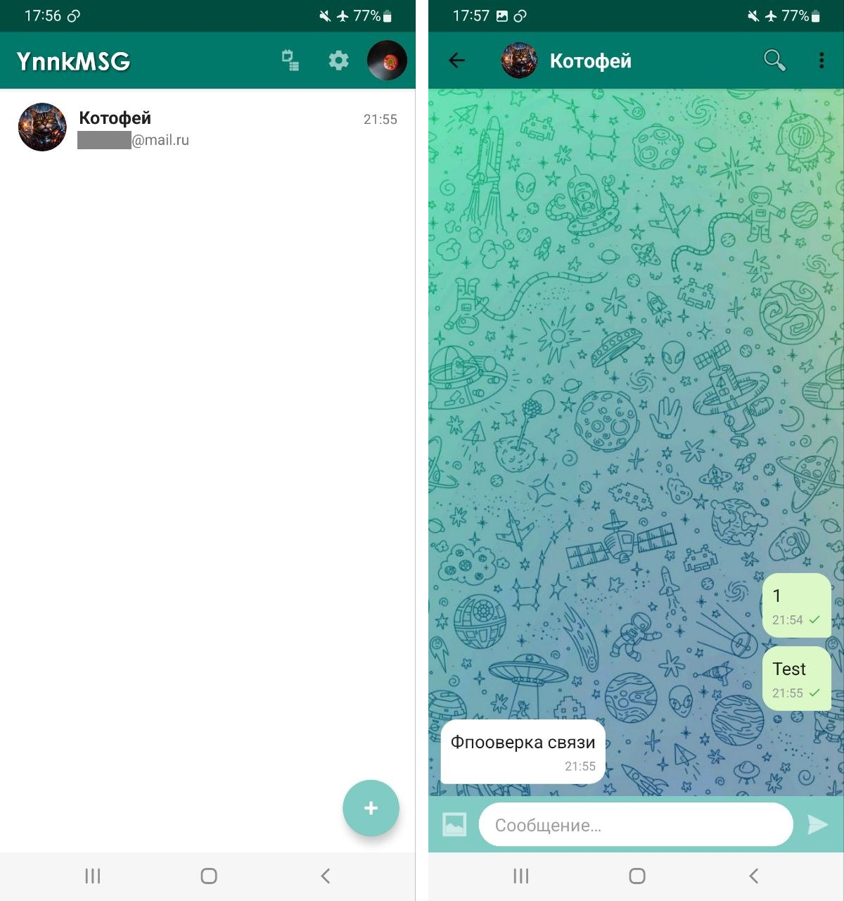

# YnnkMsg — Мессенджер на базе IMAP/SMTP

Зачем? Почему не еще один XMPP-мессенджер? Потому что электронная почта российских email-сервисов работает даже при отключении интернета aka в "белых списках".

## Что есть

Реализован только самый базовый функционал для обмена сообщениями. Помимо него есть:

- конечно же, двустороннее шифрование;
- сообщения экранируются как обычные сообщения электронной почты;
- передача фотографий и вложений, включая большие файлы (надо оптимизировать);
- можно отправлять и принимать сообщения с электронной почты, не привязанной к приложению (в этом случае шифрование и кодировка не используются);
- уведомления о прочтении.

## Ограничения

Поскольку отсутствует привязка сервисов Google, мгновенных уведомлений о новых сообщениях не будет. Обычно задержка при работе приложения в фоновом режиме будет составлять от 15 минут до пары часов. Не забудьте после установки YnnkMSG в параметрах в Android для этого приложения отключить режим экономии энергии, иначе оповещений не будет вообще. Кроме того, надо понимать, что протоколы IMAP/SMTP в принципе не предназначены для обмена мгновенными сообщениями.

## Как зарегистрироваться

1. Создайте основной аккаунт электронной почты на Яндексе, Мейл-ру или Рамблере. Использовать существующий можно, но нежелательно.

2. В веб-интерфейсе почты зайдите в настройки и включите поддержку IMAP/SMTP для почтовых клиентов. На Яндексе для этого с мобильного телефона придется перейти в полный режим.

3. В настройках аккаунта (прости хосподи, Яндекс ID, VK ID, Сбер ID) создайте "Пароль для приложений" (App Password). Приложение назовите как угодно, а сам пароль сохраните.

Для полной безопасности: повторите эти пункты для создания аккаунта Gmail. На нем тоже потребуется жестко привязать телефон (включить двухфакторную авторизацию через СМС), иначе пароли приложений доступны не будут. Да, другие способы двухфакторной авторизации не подходят, хотя прямо Google об этом не говорит.

4. Запустите приложение, на странице логина введите адрес своей электронной почты и пароль.

5. Опционально: перейдите в "Мой профиль" (клик по аватару) и вбейте адрес почты Gmail и пароль от него как второй e-mail. Если вы используете выделенный для приложения аккаунт электронной почты, который не применяется для других целей, на странице "Мой профиль" укажите, что адрес является эксклюзивным.

## Как добавить контакты

1. Ваши контакты должны установить приложение и проделать все пункты, описанные выше.

2. Вернитесь на главный экран (экран контактов, первый после запуска приложения) и нажмите кнопку "+", а затем добавьте кого угодно просто по адресу электронной почты. Отправьте ему любое сообщение, чтобы у него тоже появился ваш контакт.

3. Тапом на контакте в списке откройте окно "Посмотреть/изменить контакт" и нажмите кнопку "Обновить данные пользователя". Спустя какое-то время (в зависимости от активности приложения у второго контакта) у вас на телефоне обновится аватар контакта, его имя и появится его второй e-mail, если он его указал.

4. После этого там же нажмите кнопку "Обменяться ключами шифрования". Альтернативный вариант: просто скопируйте свой публичный ключ в "Моем профиле" и перешлите контакту через безопасный канал. Он должен проделать то же самое. Полученный от него ключ вставьте на странице "Посмотреть/изменить контакт".

После успешного обмена ключами с контактом у вас в правом нижнем углу его аватара появится икнока с замком.

5. С главной страницы перейдите в настройки приложения и включите PGP-шифрование. Можете включить и уведомления о получении сообщений, но они не доделаны.

## Для разработчиков

В приложении полно недоработок и багов, но у меня сейчас нет возможности ими заниматься. Задачи такие:

- **главное**: отполировать процесс обмена между контактами публичной информацией аккаунтов (второй email, аватар и т.п.); улучшить интерфейс, чтобы пользователь понимал, на какой стадии находится процесс;
- передачу больших файлов (которые делятся на чанки) надо оптимизировать, потому что их сборка занимает слишком много времени;
- надо сделать импорт/экспорт чатов через json;
- в экранированные темы письма добавить элемент рандома, а не просто выбирать вариант из списка;
- возможно: зашифрованные вложения тоже передавать как base26.

На 80% этот проект - нейрослоп Claude.

### Требования
- Android Studio Hedgehog (2023.1.1) или новее
- JDK 17
- Android SDK 34
- Минимальный SDK: Android 8.0 (API 26)

### Зависимости
- `com.sun.mail:android-mail:1.6.7` — JavaMail для Android
- `androidx.room` — локальная база данных
- `androidx.security:security-crypto` — шифрование пароля
- `com.github.bumptech.glide` — загрузка изображений
